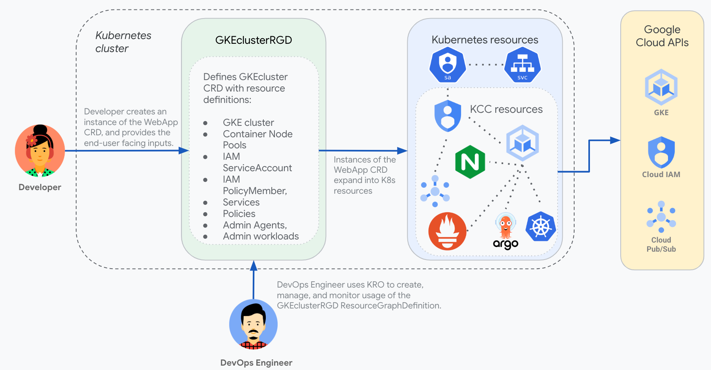

# GKECluster

A **Platform Administrator** wants to give end users in their organization self-service access to create GKE clusters. The platform administrator creates a kro ResourceGraphDefinition called *gkecluster.kro.run* that defines the required Kubernetes resources and a CRD called *GKEcluster* that exposes only the options they want to be configurable by end users. The ResourceGraphDefinition would define the following resources (using [KCC](https://github.com/GoogleCloudPlatform/k8s-config-connector) to provide the mappings from K8s CRDs to Google Cloud APIs):

* GKE cluster
* Container Node Pool
* Network
* Subnetwork
* KMSKeyRing   - Encrypt BootDisk
* KMSCryptoKey - Encrypt BootDisk

Everything related to these resources would be hidden from the end user, simplifying their experience.  



## End User: GKECluster

The administrator needs to install the RGD first.
The end user creates a `GKECluster` resource something like this:

```yaml
apiVersion: kro.run/v1alpha1
kind: GKECluster
metadata:
  name: krodemo
  namespace: config-connector
spec:
  name: krodemo         # Name used for all resources created as part of this RGD
  location: us-central1 # Region where the GCP resources are created
  maxnodes: 4           # Max scaling limit for the nodes in the new nodepool
```

They can then check the status of the applied resource:

```
kubectl get gkeclusters
kubectl get gkeclusters krodemo -n config-connector -o yaml
```

Navigate to GKE Cluster page in the GCP Console and verify the cluster creation.

Once done, the user can delete the `GKECluster` instance:

```
kubectl delete gkecluster krodemo -n config-connector
```

## Administrator: ResourceGraphDefinition
The administrator needs to install the RGD in the cluster first before the user can consume it:

```
kubectl apply -f rgd.yaml
```

Validate the RGD is installed correctly:

```
kubectl get rgd gkecluster.kro.run
```

Once all user created instances are deleted, the administrator can choose to deleted the RGD.

<details>
  <summary>ResourceGraphDefinition</summary>
  ```yaml title="rgd.yaml"
apiVersion: kro.run/v1alpha1
kind: ResourceGraphDefinition
metadata:
  name: gkecluster.kro.run
spec:
  schema:
    apiVersion: v1alpha1
    kind: GKECluster
    spec:
      name: string
      nodepool: string
      maxnodes: integer
      location: string
    status:
      masterVersion: ${cluster.status.masterVersion}
  resources:
  - id: network
    template:
      apiVersion: compute.cnrm.cloud.google.com/v1beta1
      kind: ComputeNetwork
      metadata:
        labels:
          source: "gkecluster"
        name: ${schema.spec.name}
      spec:
        #routingMode: GLOBAL
        #deleteDefaultRoutesOnCreate: false
        routingMode: REGIONAL
        autoCreateSubnetworks: false
  - id: subnet
    template:
      apiVersion: compute.cnrm.cloud.google.com/v1beta1
      kind: ComputeSubnetwork
      metadata:
        labels:
          source: "gkecluster"
        name: ${network.metadata.name}
      spec:
        ipCidrRange: 10.2.0.0/16
        #ipCidrRange: 10.10.90.0/24
        region: ${schema.spec.location}
        networkRef:
          name: ${schema.spec.name}
        #privateIpGoogleAccess: true
  - id: topic
    template:
      apiVersion: pubsub.cnrm.cloud.google.com/v1beta1
      kind: PubSubTopic
      metadata:
        labels:
          source: "gkecluster"
        name: ${subnet.metadata.name}
  - id: keyring
    template:
      apiVersion: kms.cnrm.cloud.google.com/v1beta1
      kind: KMSKeyRing
      metadata:
        labels:
          source: "gkecluster"
        name: ${topic.metadata.name}
      spec:
        location: ${schema.spec.location}
  - id: key
    template:
      apiVersion: kms.cnrm.cloud.google.com/v1beta1
      kind: KMSCryptoKey
      metadata:
        labels:
          source: "gkecluster"
        name: ${keyring.metadata.name}
      spec:
        keyRingRef:
          name: ${schema.spec.name}
        purpose: ASYMMETRIC_SIGN
        versionTemplate:
          algorithm: EC_SIGN_P384_SHA384
          protectionLevel: SOFTWARE
        importOnly: false
  - id: nodepool
    template:
      apiVersion: container.cnrm.cloud.google.com/v1beta1
      kind: ContainerNodePool
      metadata:
        labels:
          source: "gkecluster"
        name: ${cluster.metadata.name}
      spec:
        location: ${schema.spec.location}
        autoscaling:
          minNodeCount: 1
          maxNodeCount: ${schema.spec.maxnodes}
        nodeConfig:
          machineType: n1-standard-1
          diskSizeGb: 100
          diskType: pd-standard
          #taint:
          #- effect: NO_SCHEDULE
          #  key: originalKey
          #  value: originalValue
        clusterRef:
          name: ${schema.spec.name}
  - id: cluster
    template:
      apiVersion: container.cnrm.cloud.google.com/v1beta1
      kind: ContainerCluster
      metadata:
        #annotations:
        #  cnrm.cloud.google.com/remove-default-node-pool: "false"
        labels:
          source: "gkecluster"
        name: ${key.metadata.name}
      spec:
        location: ${schema.spec.location}
        initialNodeCount: 1
        networkRef:
          name: ${schema.spec.name}
        subnetworkRef:
          name: ${schema.spec.name}
        ipAllocationPolicy:
          clusterIpv4CidrBlock: /20
          servicesIpv4CidrBlock: /20
        #masterAuth:
        #  clientCertificateConfig:
        #    issueClientCertificate: false
        #workloadIdentityConfig:
        #  # Workload Identity supports only a single namespace based on your project name.
        #  # Replace ${PROJECT_ID?} below with your project ID.
        #  workloadPool: ${PROJECT_ID?}.svc.id.goog      
        notificationConfig:
          pubsub:
            enabled: true
            topicRef:
              name: ${schema.spec.name}
        loggingConfig:
          enableComponents:
            - "SYSTEM_COMPONENTS"
            - "WORKLOADS"
        monitoringConfig:
          enableComponents:
            - "SYSTEM_COMPONENTS"
            - "APISERVER"
          managedPrometheus:
            enabled: true
        clusterAutoscaling:
          enabled: true
          autoscalingProfile: BALANCED
          resourceLimits:
            - resourceType: cpu
              maximum: 100
              minimum: 10
            - resourceType: memory
              maximum: 1000
              minimum: 100
          autoProvisioningDefaults:
            bootDiskKMSKeyRef:
              name: ${schema.spec.name}
        nodeConfig:
          linuxNodeConfig:
            sysctls:
              net.core.somaxconn: "4096"
            cgroupMode: "CGROUP_MODE_UNSPECIFIED"
      
  ```
</details>
